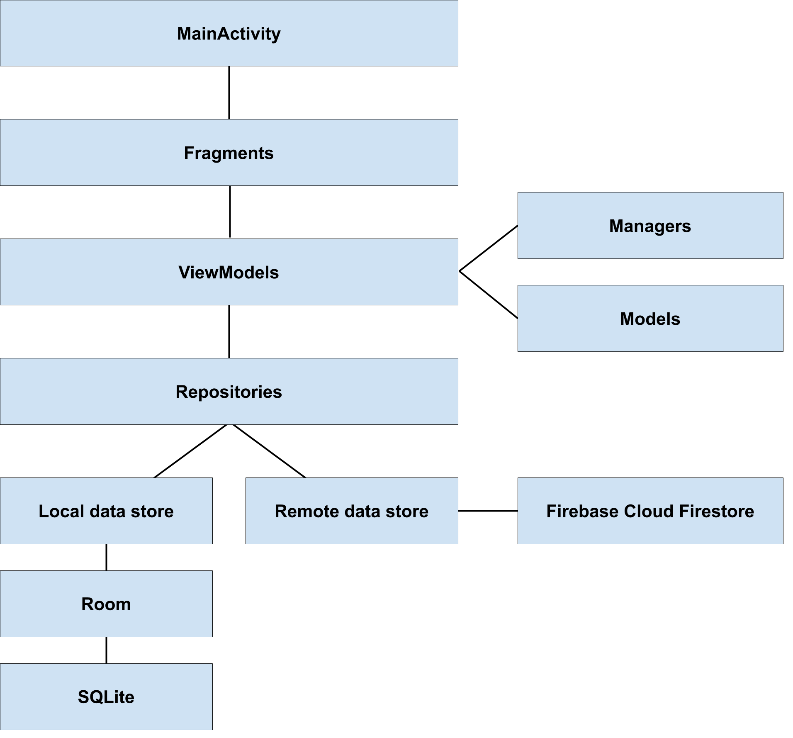

# Ground Android app architecture

The Ground Android app is written in Java and uses the [Android Jetpack](https://developer.android.com/jetpack) and [RxJava](https://github.com/ReactiveX/RxJava) libraries, among others. This page provides an overview of the high-level app architecture, including key components and libraries.

<!-- Editable image source: https://docs.google.com/drawings/d/1UjetRJsudLHg3YsWaf0sKqHfmrPNNBH4UKI7Ivajx-0/ -->

## Components

The app is comprised of the following components:

- **MainActivity**: Ground is a single-activity app. The main [activity](https://developer.android.com/guide/components/activities/intro-activities) contains all other app components.
- **Fragments**: Each part of the app UI is defined as a [fragment](https://developer.android.com/guide/components/fragments). Examples of fragments are the home screen and the map interface.
- **ViewModel**: Each fragment has a corresponding [ViewModel](https://developer.android.com/topic/libraries/architecture/viewmodel), which encapsulates its UI state, logic, and functionality, as well as the lifecycle callback methods.
- **Managers**: The app managers abstract access to system services directly for the ViewModels. Examples of services handled by managers are location services and camera access.
- **Model**: Entity representations used throughout the app, such as the app's representations of map concepts, are defined by the model. The model package represents data across the various components of the app. Examples of entities defined by the model are the app's representation of offline imagery.
- **Repository**: The model classes are linked to the repositories, which are organized by thematic area, that define the APIs for interaction between ViewModels and data stores. 
    - **Local data store**: Local data is stored in a SQLite database and the app uses the [Room persistence library](https://developer.android.com/topic/libraries/architecture/room) to manage interaction with the library.
    - **Remote data store**: Remote data is stored in [Firebase Cloud Firestore](https://firebase.google.com/docs/firestore). For more information on how remote data is structured, see [Cloud Firestore Representation](https://github.com/google/ground-platform/wiki/Cloud-Firestore-Representation)
- **Workers** (not pictured in the diagram): Jobs that that can run while the app is closed are implemented via [workers](https://developer.android.com/reference/androidx/work/Worker). For example, syncing local and remote data when a network connection is available is a task that can run while the app is closed and is handled by a worker.

## Data flows

- Application components rely heavily on [LiveData](https://developer.android.com/topic/libraries/architecture/livedata) and [RxJava](https://github.com/ReactiveX/RxJava) to represent asynchronous flows of events and data through the app.
- Dependency injection between components are managed via [Hilt](https://developer.android.com/training/dependency-injection/hilt-android) (Dagger).
- Data is always written locally first and then queued to be synced with the remote data store, in both directions.

